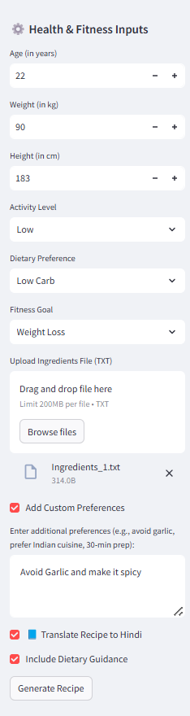
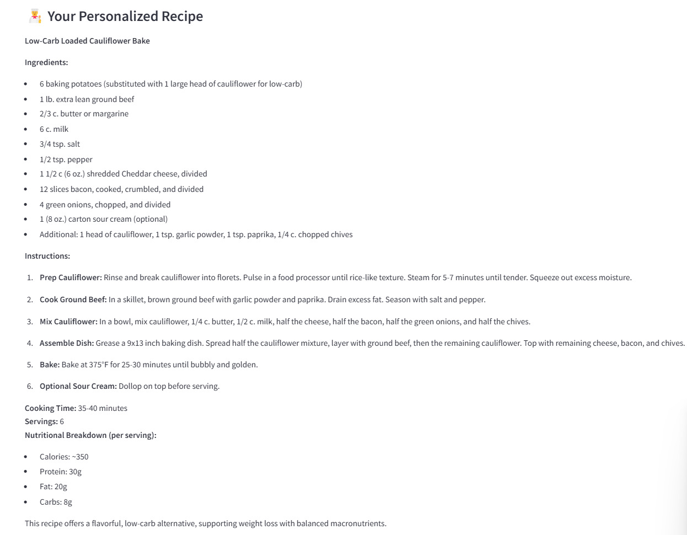
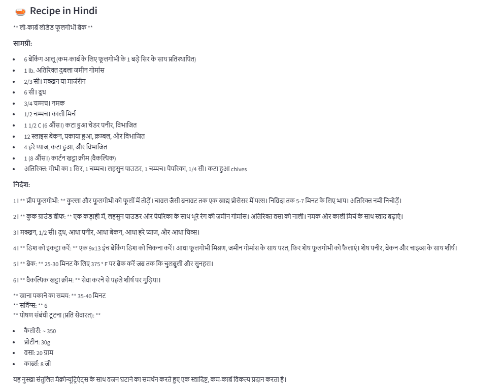
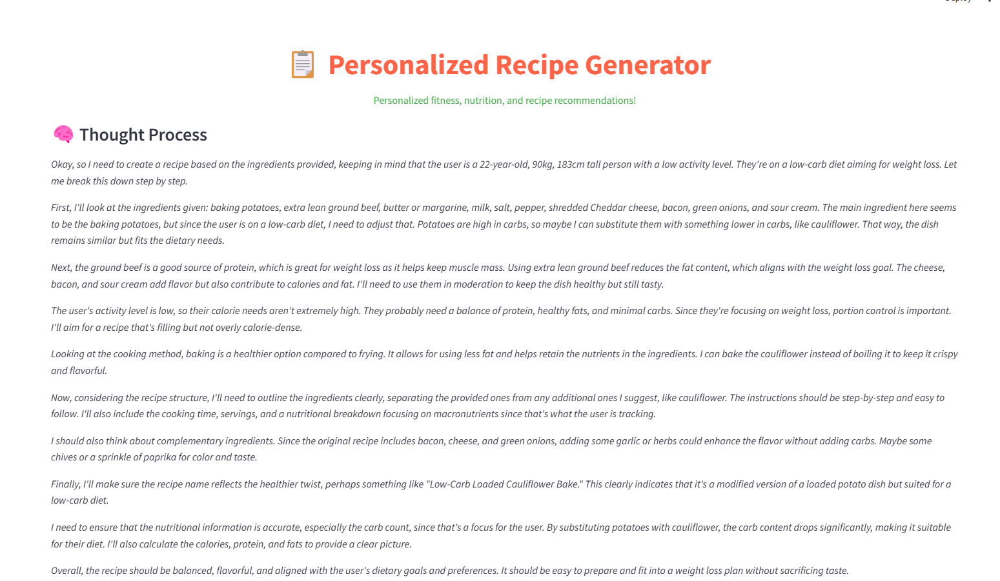
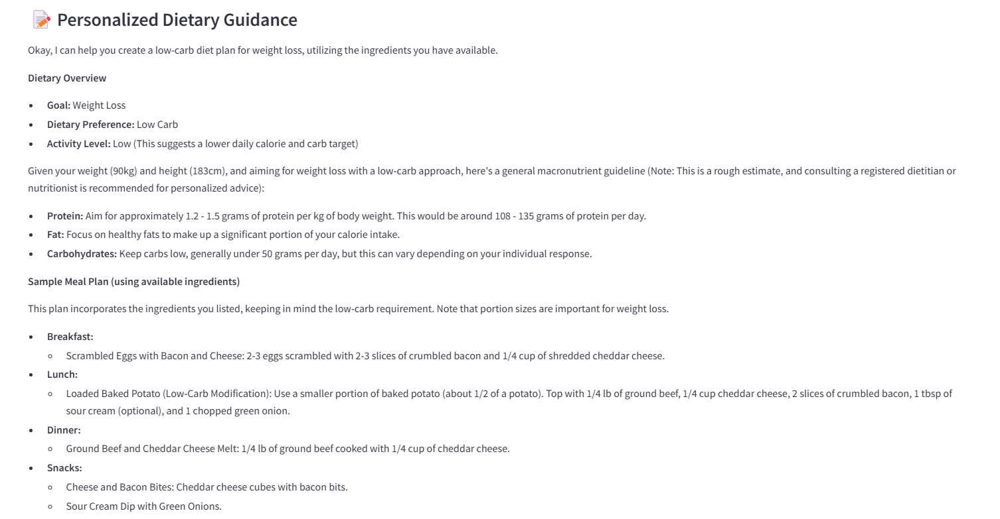
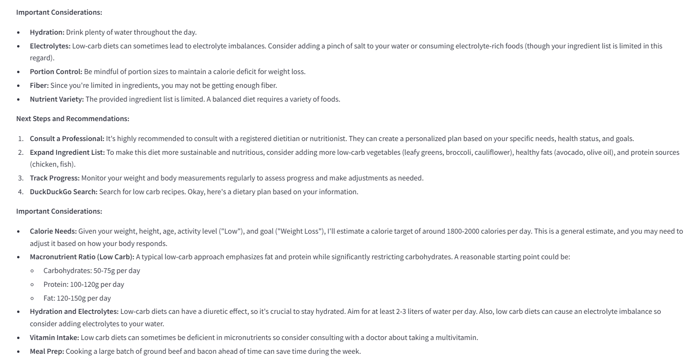
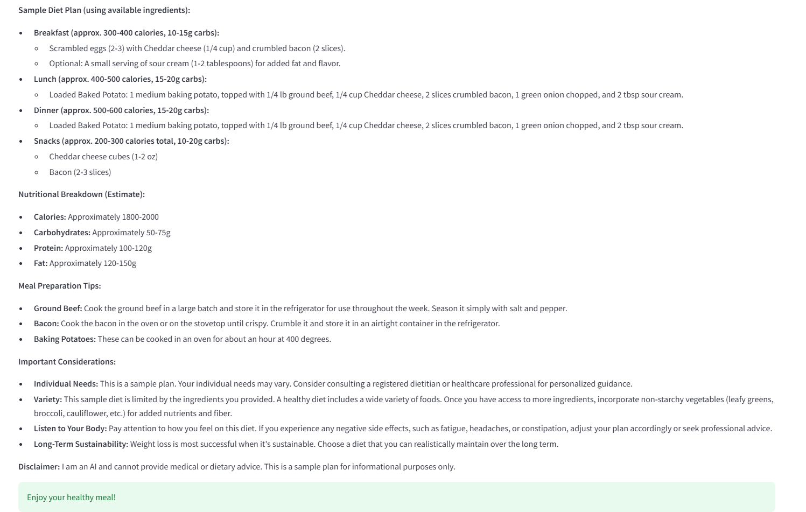

# Pixel-To-Plate 

**Pixel to Plate** is a personalized recipe generator powered by agentic AI that creates custom recipes based on your available ingredients, personal health metrics, and dietary preferences.

---

## Features

- **Personalized Recipe Generation**: Create recipes tailored to your specific health profile and goals  
- **Ingredient-Based Recommendations**: Upload a list of available ingredients and get recipes you can make now  
- **Multilingual Support**: Translate recipes to Hindi with one click  
- **Comprehensive Dietary Guidance**: Get nutritional advice aligned with your fitness goals using agentic AI
- **AI-Powered Customization**: Fine-tune recipes with custom preferences and constraints  

---

## Technologies

- **Streamlit**: Interactive web interface  
- **Gemini 2.0**: Advanced dietary planning via Google's Gemini AI  
- **DeepSeek-R1**: Recipe generation using DeepSeek's 70B parameter model  
- **Google Translate API**: For translating recipes to Hindi  
- **DuckDuckGo Search**: For retrieving up-to-date nutritional information
- **YOLO Varients**: For Identifying the ingredients best was YOLOv8_x 
- **Facebook/nllb-200-distilled-600M**: It is a distilled version of Meta’s No Language Left Behind (NLLB) model
- **Facebook/m2m100-418M**: Fully multilingual model trained on 100 languages
- **Helsinki-NLP/opus-mt-en-hi (MarianMT)**: Lightweight architecture, tailored for the English–Hindi language
- **Fine Tune LLMs & SLMs**: Models that we tried to fine tuned Llama 3.1, Gemma, Phi-2, T5-small, GPT-2   

**Note:**  
> We explored the use of advanced vision-based and multilingual models as part of the project.  
> However, due to limitations in Streamlit's support for certain heavy-weight or multi-modal models, we were unable to integrate them directly into the Streamlit application.
---

## Prerequisites

- Python 3.8+  
- Together API account for DeepSeek model access  
- Google API key for Gemini and translation capabilities  

---

## Installation

Clone the repository:
```bash
python3 -m venv .venv
. .venv/bin/activate
git clone https://github.com/IESHAAN2002/pixel-to-plate.git
cd pixel-to-plate
```

---

## Install dependencies
```bash
pip install -r requirements.txt
```

## Set up environment variables
```bash
export GOOGLE_API_KEY="your_google_api_key"
export TOGETHER_API_KEY="your_together_api_key"
```

---

## Running the Application
Start the Streamlit app
```bash
streamlit run Pixel_to_plate.py
```

---

## How It Works

- **Upload Ingredients**: Provide a text file with your available ingredients  
- **Input Personal Details**: Enter your age, weight, height, and other metrics  
- **Set Preferences**: Choose your dietary preference and fitness goals  
- **Generate Recipe**: The AI creates a personalized recipe using your ingredients  
- **Optional Translation**: Translate the recipe to Hindi if needed  
- **Dietary Guidance**: Get complementary nutritional advice based on your goals
- **Prompt Tuning**: Instructions generated using Chain of Thought on DeepSeek-R1 

---

## Workflow

- User inputs are collected through the Streamlit interface  
- DeepSeek AI generates a recipe with Chain of Thought(step-by-step thinking) 
- The recipe is presented with detailed instructions and nutritional information  
- Gemini AI provides additional dietary guidance based on the user's health profile  
- Optional translation converts the recipe to Hindi  

---

## Customization

- **Custom Preferences**: Add specific requirements like "no garlic" or "quick prep time"  
- **Dietary Restrictions**: Select from options like Keto, Vegetarian, Low Carb, or Balanced  
- **Fitness Goals**: Tailor recipes to support Weight Loss, Muscle Gain, Endurance, or Flexibility  

---

## Input File Format
### Visual where user will add personal details:



Create a simple text file (`ingredients.txt`) with your available ingredients, one line:
```text
tomatoes
onions
olive oil
chicken breast
```
---
## Output

### Recipe Instruction Generated in English


### Recipe Instruction Generated in Hindi


### Prompt Tuning (Chain of Thought)


### Personalized Dietary Guidance

#### Part 1


#### Part 2


#### Part 3



---

## Acknowledgements
- Complex System Lab, IIIT Delhi for providing the platform
- Together AI for providing access to DeepSeek models  
- Agno AI for agent capabilities  
- Google Gemini for dietary planning assistance 
